.. _tutorial:

*********
Tutorial
*********

This is a simple tutorial demonstrating the main functionalities of :py:mod:`pyqha`. The examples below show how to use the package to perform the most common tasks. The code examples can be found in the directory *examples* of the package and can be run either as interactive sessions in your Python intepreter or as scripts.
The tutorial is based on the following examples:

+---------------+------------------------------------------------------------------------------------------------------------------------------------------+
| Example n.    | Description                                                                                                                              |
+===============+==========================================================================================================================================+
| 1             | Fit :math:`E_{tot}(V)` for a cubic (isotropic) system using Murnaghan EOS                                                                |
+---------------+------------------------------------------------------------------------------------------------------------------------------------------+
| 2             | Fit :math:`E_{tot}(a,c)` for an hexagonal (anisotropic) system  using a polynomial                                                       |
+---------------+------------------------------------------------------------------------------------------------------------------------------------------+
| 3             | Calculate the harmonic thermodynamic properties (ZPE, vibrational energy, Helmholtz energy, entropy and heat capacity from a phonon DOS  |
+---------------+------------------------------------------------------------------------------------------------------------------------------------------+
| 4             | Calculate the harmonic thermodynamic properties as in the previous examples from several phonon DOS                                      |
+---------------+------------------------------------------------------------------------------------------------------------------------------------------+
| 5             | A quasi-harmonic calculation for a cubic (isotropic) system using Murnaghan EOS                                        	           |
+---------------+------------------------------------------------------------------------------------------------------------------------------------------+
| 6             | A quasi-harmonic calculation for an hexagonal (anisotropic) system  using a quadratic polynomial                                         |
+---------------+------------------------------------------------------------------------------------------------------------------------------------------+
| 7             | A quasi-static calculation for the elastic tensor of an hexagonal (anisotropic) system  using a quadratic polynomial                     |
+---------------+------------------------------------------------------------------------------------------------------------------------------------------+

Several simplified plotting functions are available in :py:mod:`pyqha` and are used in the following tutorial to show what you can plot.
Note however that all plotting functions need the matplotlib library, which must be available on your system and can be used to further taylor your plot. 

=========================
Fitting the total energy
=========================

The simplest task you can do with :py:mod:`pyqha` is to fit the total energy as a function of volume :math:`E_{tot}(V)` (example1) or lattice parameters values :math:`E_{tot}(a,b,c,\alpha,\beta,\gamma)` (example2). In the former case, you can use
an equation of state (EOS) such as Murnaghan's or similar. In the latter case, you must use polynomials. Currently the Murnaghan EOS and quadratic and quartic polynomials are implemented in :py:mod:`pyqha`. Besides, only :math:`a,b,c` lattice parameters can be handled. This includes cubic, hexagonal, tetragonal and orthorombic systems.

Let's start with the simpler case where we want to fit :math:`E_{tot}(V)`. This is the case of isotropic cubic systems (simple cubic, body centered cubic, face centered cubic) or systems which can be approximate as isotropic (for example an hexagonal system with nearly constant :math:`c/a` ratio).

.. literalinclude:: ../examples/example1/example1.py
   :language: python
   :dedent: 4
   :lines: 10-
   
The :py:func:`fitEtotV` needs in input a file with two columns: the first with the volumes (in :math:`a.u.^3`), the second with energies (in :math:`Ryd/cell`). It returns the volumes *V* and energies *E* from the input file plus the fitting coefficients *a* and the :math:`\chi^2` *chi*. The fitting results are also written in details on the *stdout*:

.. literalinclude:: ../examples/example1/out

Optionally, you can plot the results with the :py:func:`plot_EV`. The original data are represented as points. If *a!=None*, a line with the fitting EOS will also be plotted. The output plot looks like the following:

.. image:: ../examples/example1/figure_1.png
   :width: 500

The second example shows how to fit the total energy of an hexagonal system, i.e. as a function of the lattice parameters :math:`(a,c)`. The input file (*fin*) contains three columns, the first two with the :math:`(a,c)` (in :math:`a.u.`) and the third one with the energies (in :math:`Ryd/cell`). Note that if the original data are as :math:`(a,c/a)`, as often reported, you must convert the :math:`c/a` values into :math:`c` values in the input file.
The :py:func:`fitEtot` reads the input file and perform the fit using either a quadratic or quartic polynomial (as specified by the parameter *fitype*).   

.. literalinclude:: ../examples/example2/example2.py
   :language: python
   :dedent: 4
   :lines: 12-

The output of the fitting function is:

.. literalinclude:: ../examples/example2/out
   :language: text

Optionally, you can use the functions :py:func:`plot_Etot`, :py:func:`plot_Etot_contour` to create 3D or contour plots of the fitted energy over the grid :math:`(a,c)`, including or not the original energy points:

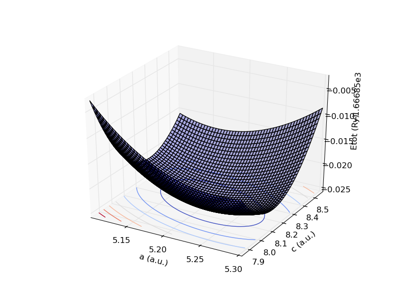
.. image:: ../examples/example2/figure_2.png
   :width: 500
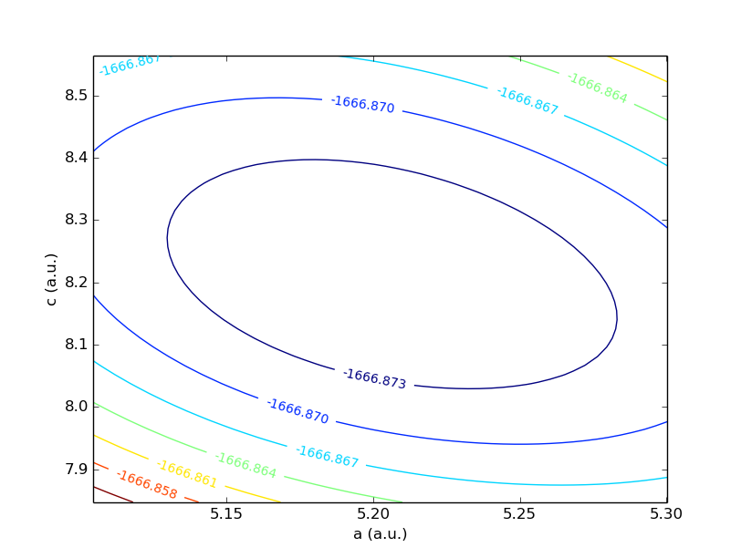

================================================
Computing thermal properties from phonon DOS
================================================

:py:mod:`pyqha` can calculate the vibrational properties of your system from the phonon DOS in the harmonic approximation as shown in *example3*. The DOS file must be a two columns one, the first column being the energy (in :math:`Ryd/cell`) and the second column being the density of states (in :math:`(Ryd/cell)^{-1}`). 

.. literalinclude:: ../examples/example3/example3.py
   :language: python
   :dedent: 4
   :lines: 11-

The output produced by the function :py:func:`compute_thermo` is stored in the variables *T, Evib, Svib, Cvib, Fvib, ZPE, modes* and can be written in a file using the function :py:func:`write_thermo`. This output file is as:

.. literalinclude:: ../examples/example3/thermo
   :language: text
   :lines: 1-40

The first line is the simple integral of the input dos. It must be approximately equal to :math:`3N`, where *N* is the number of atoms in the cell. In the present case (hex Os) it is equal to 6. The second line shows the Zero Point Energy (ZPE). After a few comments lines, the vibrational energy (Evib), Helmholtz energy (Fvib), entropy (Svib) and heat capacity (Cvib) are written as a function of temperature. All quantities are calculated in the harmonic approximation, i.e. for fixed volume (and lattice parameters).

The original dos is plotted as:

.. image:: ../examples/example3/figure_1.png
   :width: 500

The calculated thermodynaminc functions are plotted as: 

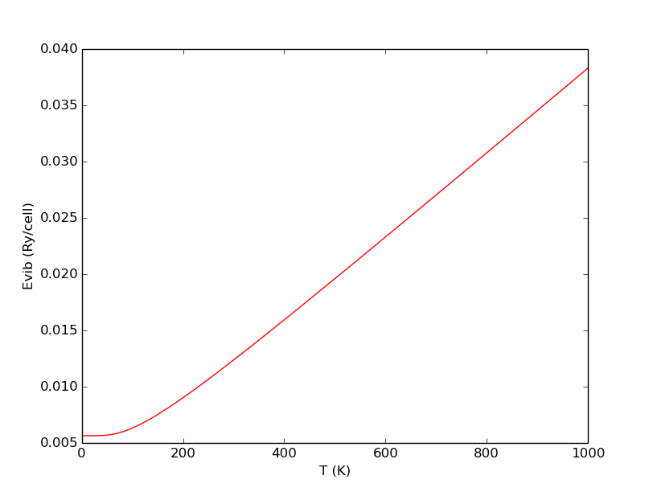
.. image:: ../examples/example3/figure_3.png
   :width: 400
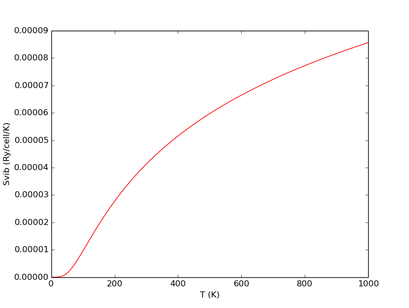
.. image:: ../examples/example3/figure_5.png
   :width: 400

The following code (example4) shows how multiple dos files can be handled, a step which is preliminary to a quasi-harmonic calculation. The dos are for different volumes (for hexagonal Os).

.. literalinclude:: ../examples/example4/example4.py
   :language: python
   :dedent: 4
   :lines: 10-

The first 5 phonon dos are plotted as (color order is: black, red, blue, green, cyan for increasing volumes):

.. image:: ../examples/example4/figure_1.png
   :width: 500

The corresponding vibrational Helmoltz energies, entropies and heat capacity are plotted as:

.. image:: ../examples/example4/figure_2.png
   :width: 400
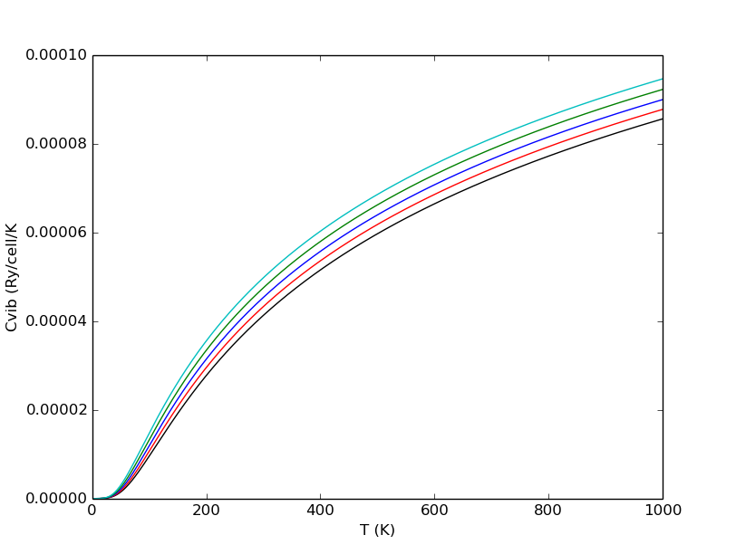
.. image:: ../examples/example4/figure_4.png
   :width: 400

================================================
Computing quasi-harmonic properties 
================================================

Here we show how to do a full quasi-harmonic calculation starting from the :math:`E_{tot}` and phonon DOS. First, we show an example using the Murnaghan EOS, having :math:`E_{tot}(V)` and the corresponding DOS, then using a quartic polynomial on the full grid :math:`(a,c)` for an hexagonal cell.

Here is the code in the Murnaghan case:

.. literalinclude:: ../examples/example5/example5.py
   :language: python
   :dedent: 4
   :lines: 10-

Note from the first line that there are some constants you can import from the module and use for unit conversions. See the documentation for more details on which ones are available.
In this example, 9 volumes are used (ngeo=9). First the harmonic thermodynamic properties are computed as in the previous example. You store these quantities in a list called *thermodata*. You also need to read the total energies as in example 1 from the file *Etot.dat*, which is taken care inside the function :py:func:`fitEtotV`. This is the function which is really doing the quasi-harmonic calculations, i.e. it fits a Murnaghan EOS at each T using :math:`E_{tot}(V)+F_{vib}(V,T)`. It returns *TT, Fmin, Vmin, B0, betaT, Cv, Cp*, which are all numpy 1D arrays containing the temperatures where the calculations were done and the resulting minimun Helmholtz energy (at each T), minimun volume, isobaric bulk modulus, volume thermal expansion, constant volume and constant pressure heat capacities, respectively. These quantities correspond to :math:`P=0`.

The following lines show how to plot each quantity on a single plot (using the function :py:func:`simple_plot_xy`), write the results in files (using the :py:func:`write_xy`) and plot both *Cv* and *Cp* in a single plot (using the function :py:func:`multiple_plot_xy`). 

If everything went well, you should get the following plots:

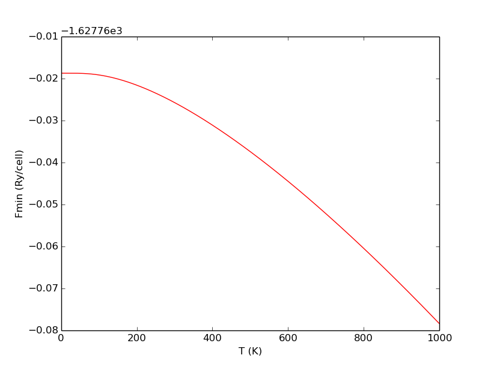
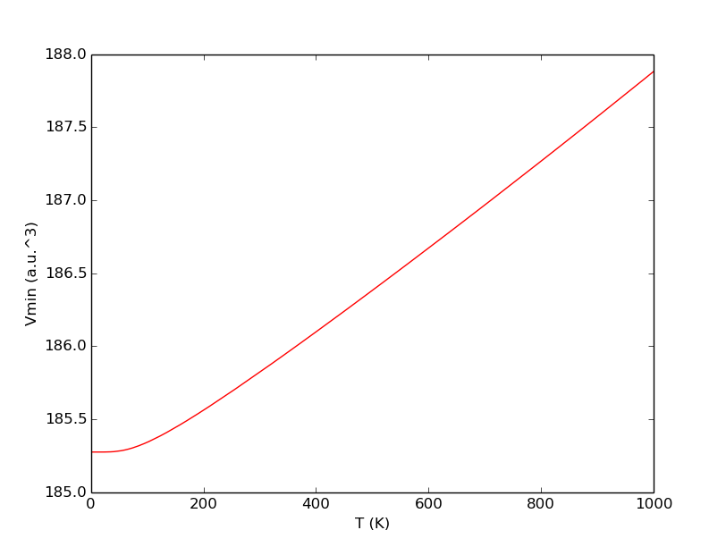
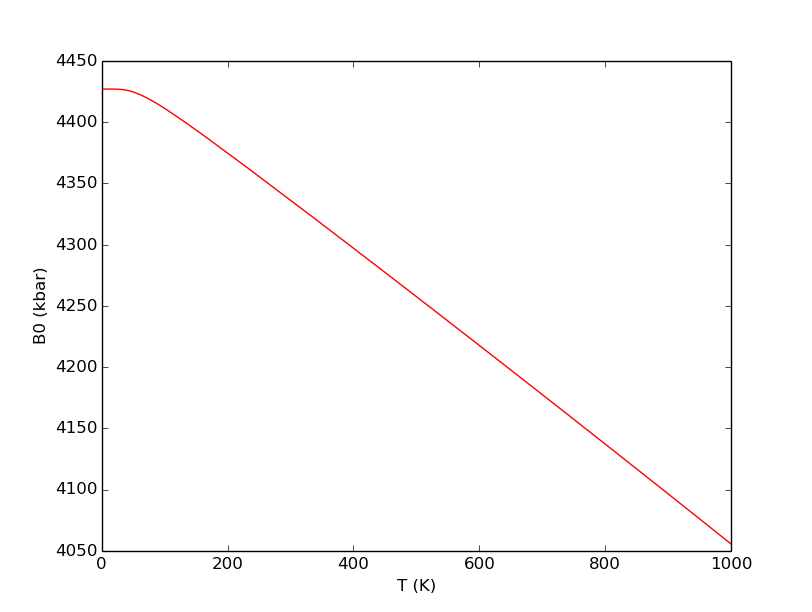
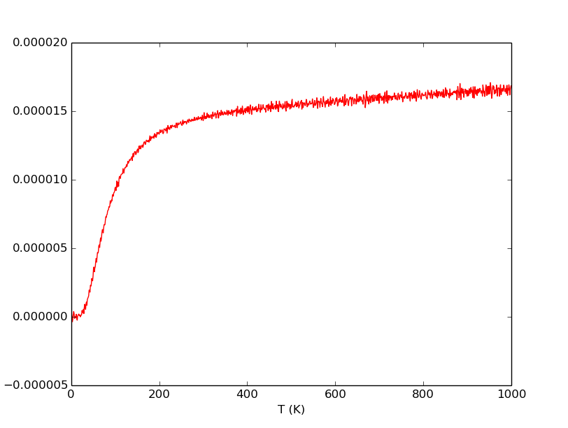
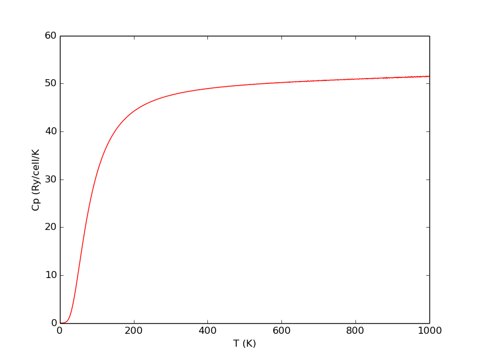
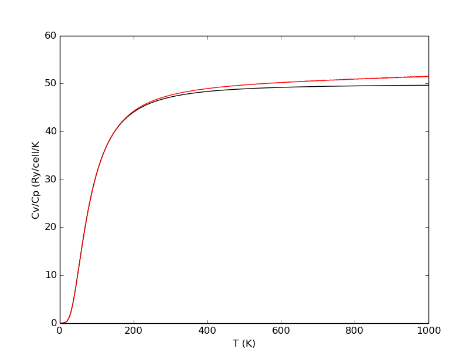

In the following we show the code for a similar example of an hexagonal (anisotropic) system. The code is similar to the previous examples with a few important differences.

.. literalinclude:: ../examples/example6/example6.py
   :language: python
   :dedent: 4
   :lines: 10-

If everything went well,  you should get the following plots:

.. image:: ../examples/example6/figure_1.png
   :width: 400
.. image:: ../examples/example6/figure_2.png
   :width: 400
.. image:: ../examples/example6/figure_3.png
   :width: 400
.. image:: ../examples/example6/figure_4.png
   :width: 400
.. image:: ../examples/example6/figure_5.png
   :width: 400
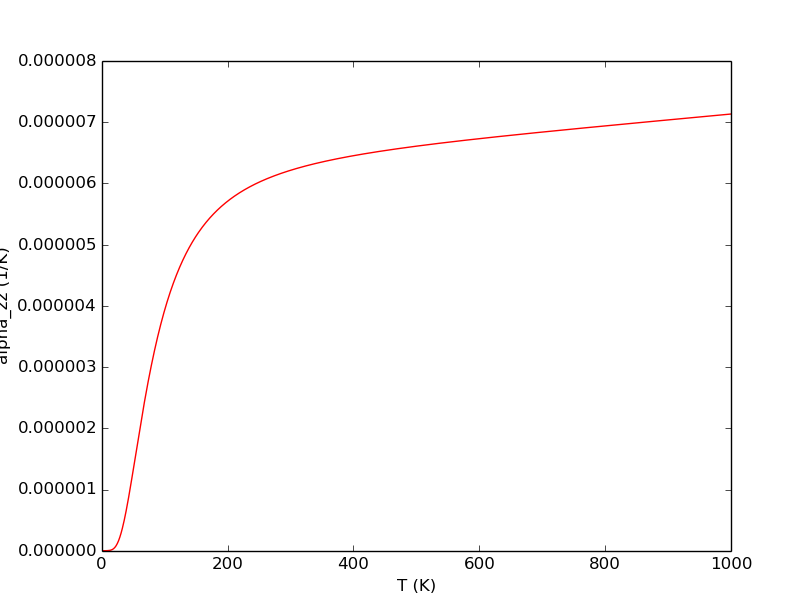

================================================
Computing quasi-static elastic constant 
================================================

The following code example shows how to do a calculation of a quasi-static elastic tensor as a function of temperature for an hexagonal system. This kind of calculation requires that a quasi-harmonic calculation has already be done (as in example 6). Besides, the elastic constants for different :math:`(a,c)` values must be available. To compute these elastic constants you can use for example the thermo_pw code [#thermo_pw]_.

.. literalinclude:: ../examples/example7/example7.py
   :language: python
   :dedent: 4
   :lines: 10-

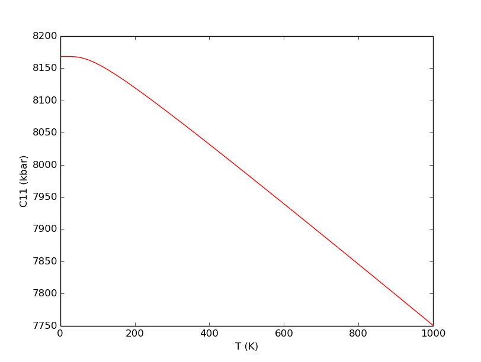
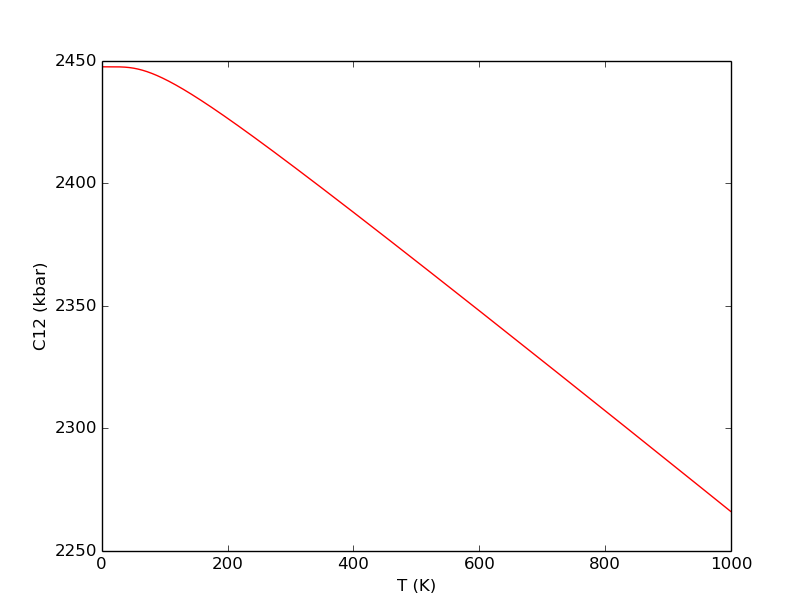
.. image:: ../examples/example7/figure_3.png
   :width: 400
.. image:: ../examples/example7/figure_4.png
   :width: 400
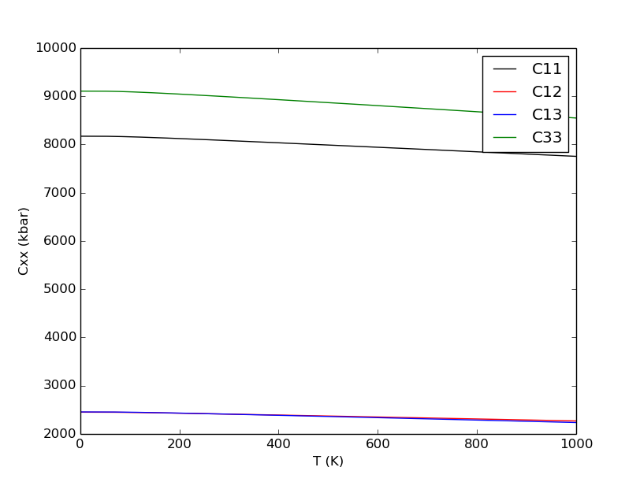

.. [#thermo_pw] http://qeforge.qe-forge.org/gf/project/thermo_pw/

